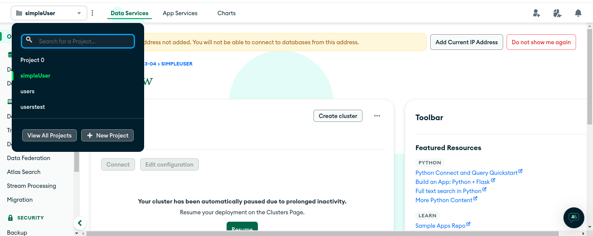
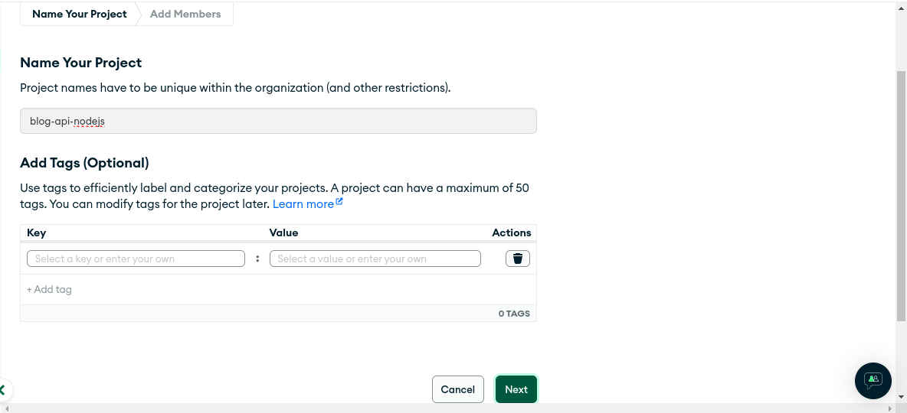
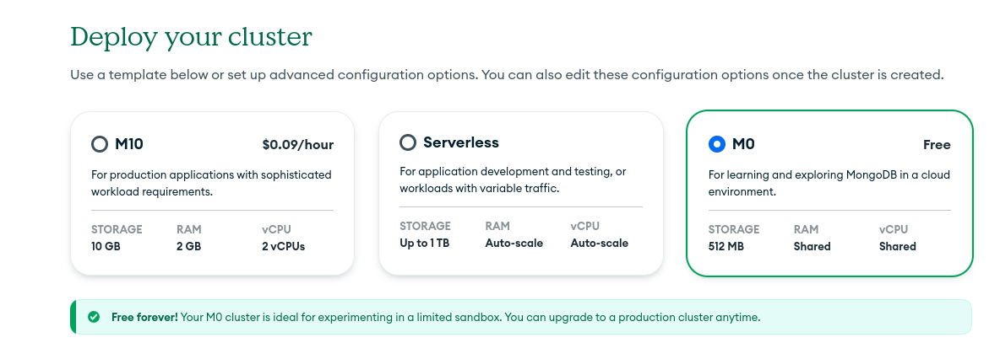
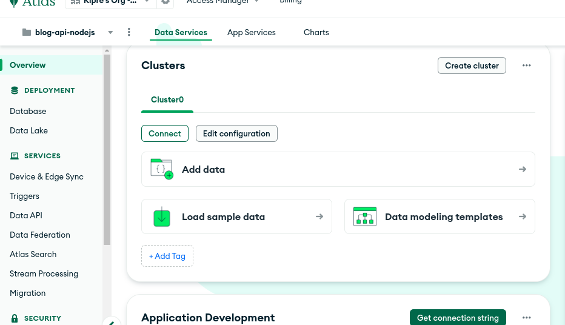
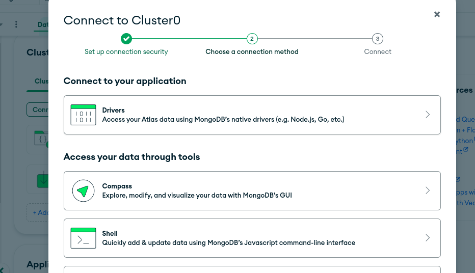
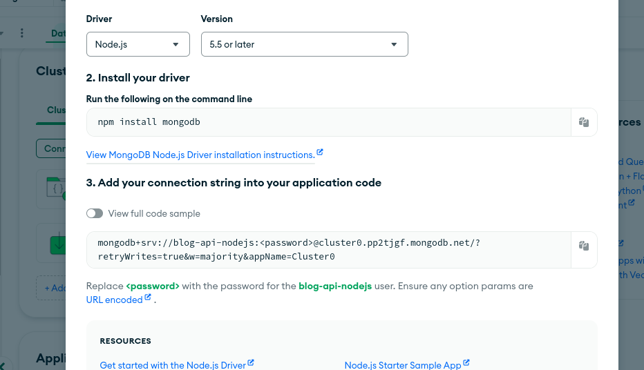

# NODE JS API BUILDING A BLOG APPLICATION

## 1- installation des extension a utiliser

**télécharger l'extension thunder client vs code.**

* pourquoi?

Thunder Client est comparable à des outils comme Insomnia et Postman dans le sens où ils ont tous pour objectif de faciliter le test et le débogage des requêtes HTTP et des API.

Cette extension offre une interface utilisateur conviviale et intuitive pour envoyer des requêtes HTTP et observer les réponses directement depuis l'éditeur de code.

**télécharger l'extension Mongodb**

* pourquoi?


Installer l'extension MongoDB pour Visual Studio Code serait une bonne idée pour plusieurs raisons :

* Gestion de la base de données directement depuis l'IDE : L'extension permet d'accéder et de gérer votre base de données MongoDB directement depuis Visual Studio Code, sans avoir besoin de passer à un autre outil ou à l'interface en ligne de commande.

* Exploration des données : Vous pouvez explorer facilement les collections, afficher les documents, exécuter des requêtes et des commandes MongoDB directement depuis l'IDE, ce qui facilite le processus de développement et de débogage.

* Syntaxe de requête améliorée : L'extension offre souvent une syntaxe améliorée pour écrire des requêtes MongoDB, avec une coloration syntaxique et une mise en forme automatique, ce qui rend la manipulation de la base de données plus agréable et plus efficace.

* Développement plus fluide : En intégrant la gestion de la base de données directement dans votre flux de travail de développement, vous pouvez gagner du temps et améliorer votre productivité en réduisant les interruptions et les transitions entre les outils.

* Intégration avec d'autres outils : L'extension MongoDB pour Visual Studio Code peut également être intégrée à d'autres extensions ou outils que vous utilisez dans votre environnement de développement, ce qui vous permet de personnaliser et d'optimiser votre flux de travail selon vos besoins spécifiques.

## 2- creation d'un environement virtuel et creation d'un gitignore
virtualenv <nom_de_env_virtuel>

```javascript
virtualenv venv
```

## 3- initialisation u projet avec npm

saisir dans le terminal
```javascript
npm init
```

voici un peu ce qui sortira:

```javascript
(venv) titodevops@attito:~/Bureau/Boulot/blog-api-node$ npm init
This utility will walk you through creating a package.json file.
It only covers the most common items, and tries to guess sensible defaults.

See `npm help init` for definitive documentation on these fields
and exactly what they do.

Use `npm install <pkg>` afterwards to install a package and
save it as a dependency in the package.json file.

Press ^C at any time to quit.

package name: (blog-api-node) 
version: (1.0.0) 
description: blog api using nodejs and mongodb
entry point: (index.js) server.js
test command: 
git repository: (https://github.com/Codelabsolux/blog-api-node.git) 
keywords: Node js, Express js, Mongodb
author: kessa99
license: (ISC) 
About to write to /home/titodevops/Bureau/Boulot/blog-api-node/package.json:

{
  "name": "blog-api-node",
  "version": "1.0.0",
  "description": "blog api using nodejs and mongodb",
  "main": "server.js",
  "scripts": {
    "test": "echo \"Error: no test specified\" && exit 1"
  },
  "repository": {
    "type": "git",
    "url": "git+https://github.com/Codelabsolux/blog-api-node.git"
  },
  "keywords": [
    "Node",
    "js",
    "Express",
    "js",
    "Mongodb"
  ],
  "author": "kessa99",
  "license": "ISC",
  "bugs": {
    "url": "https://github.com/Codelabsolux/blog-api-node/issues"
  },
  "homepage": "https://github.com/Codelabsolux/blog-api-node#readme"
}


Is this OK? (yes) yes
(venv) titodevops@attito:~/Bureau/Boulot/blog-api-node$ 
```

UN fichier package.json sera cree juste la suite. Vous y retrouverez encore les meme informations

fichier package.json
```javascript
{
  "name": "blog-api-node",
  "version": "1.0.0",
  "description": "blog api using nodejs and mongodb",
  "main": "server.js",
  "scripts": {
    "test": "echo \"Error: no test specified\" && exit 1"
  },
  "repository": {
    "type": "git",
    "url": "git+https://github.com/Codelabsolux/blog-api-node.git"
  },
  "keywords": [
    "Node",
    "js",
    "Express",
    "js",
    "Mongodb"
  ],
  "author": "kessa99",
  "license": "ISC",
  "bugs": {
    "url": "https://github.com/Codelabsolux/blog-api-node/issues"
  },
  "homepage": "https://github.com/Codelabsolux/blog-api-node#readme"
}

```
## 4- creation du fichier pour demarrer notre server et des autres fichier necessaire

fichier pour lancer notre server:
- server.js

autres fichier:
- routes
- controllers
- models
- config
- middlewares
- utils


Bien sûr, voici une description des fonctionnalités des autres dossiers et des éléments qu'ils peuvent contenir pour assurer une bonne maintenance du code dans votre projet Node.js :

1. **`routes/` (Répertoire des fichiers de routage)** :
   - Ce répertoire contient des fichiers de routage qui définissent les points de terminaison de votre API. Chaque fichier de routage peut être responsable d'un ensemble spécifique de fonctionnalités ou de ressources de votre application.
   - Outre le fichier `index.js`, vous pouvez avoir plusieurs fichiers de routage correspondant à différentes parties de votre application. Par exemple, vous pourriez avoir `userRoutes.js`, `productRoutes.js`, etc., pour regrouper les routes liées aux utilisateurs et aux produits respectivement.

2. **`controllers/` (Répertoire des contrôleurs)** :
   - Ce répertoire contient des contrôleurs qui traitent les requêtes entrantes des routes. Les contrôleurs agissent comme des gestionnaires pour les différentes actions que votre application peut effectuer en réponse à une requête HTTP.
   - Outre le fichier `index.js`, vous pouvez avoir plusieurs fichiers de contrôleurs pour traiter différentes actions ou logiques métier de votre application. Par exemple, `userController.js`, `productController.js`, etc.

3. **`models/` (Répertoire des modèles de données)** :
   - Ce répertoire contient les modèles de données qui définissent la structure de vos documents MongoDB ou d'autres types de données dans votre application.
   - Outre le fichier `index.js`, vous pouvez avoir plusieurs fichiers de modèles pour représenter différentes entités de votre application. Par exemple, `User.js`, `Product.js`, etc.

4. **`config/` (Répertoire de configuration)** :
   - Ce répertoire contient les fichiers de configuration de votre application, tels que la configuration de la base de données MongoDB (`database.js` dans votre cas). Vous pouvez également inclure d'autres fichiers de configuration, comme la configuration de l'authentification, la configuration du serveur, etc.
   - En plus du fichier `database.js`, vous pouvez avoir d'autres fichiers de configuration spécifiques à votre application.

5. **`middlewares/` (Répertoire des middlewares)** :
   - Ce répertoire contient les middlewares, qui sont des fonctions intermédiaires utilisées pour traiter les requêtes HTTP avant qu'elles n'atteignent les routes finales.
   - Outre le fichier `auth.js`, vous pouvez avoir d'autres middlewares pour gérer différentes tâches telles que l'authentification, l'autorisation, la validation des données, etc.


Si vous souhaitez ajouter des éléments HTML ou React à votre projet Node.js, vous pouvez les organiser de la manière suivante :

1. **Dossier `public/`** :
   - Vous pouvez créer un dossier nommé `public/` à la racine de votre projet. Ce dossier contiendra les ressources statiques de votre application web, telles que les fichiers HTML, CSS, JavaScript, images, etc.
   - Par exemple, vous pouvez créer un fichier HTML principal nommé `index.html` dans ce dossier, qui servira de point d'entrée pour votre application web.

2. **Dossier `views/`** (Optionnel) :
   - Si vous utilisez un moteur de template comme EJS ou Pug pour générer des pages web dynamiques, vous pouvez créer un dossier `views/` à la racine de votre projet pour stocker vos fichiers de vues.
   - Vous pouvez créer des fichiers EJS ou Pug dans ce dossier pour générer dynamiquement le contenu HTML en fonction des données fournies par votre application.
   - Cependant, si vous utilisez React pour le rendu côté client, vous n'avez pas besoin de ce dossier.

3. **Intégration de React** :
   - Si vous souhaitez utiliser React pour construire des interfaces utilisateur dynamiques et interactives, vous pouvez créer un dossier dédié à React, tel que `client/` ou `src/`.
   - Dans ce dossier, vous pouvez organiser votre code React en utilisant une structure typique, par exemple :
     ```
     client/
     ├── components/      // Composants React réutilisables
     ├── pages/           // Pages de votre application React
     ├── App.js           // Composant principal de l'application
     ├── index.js         // Point d'entrée de l'application React
     └── ...
     ```
   - Le fichier `index.js` serait le point d'entrée de votre application React, où vous rendriez votre composant principal (`App.js`) dans le DOM.
   - Vous pouvez également utiliser des outils comme Create React App pour créer une structure de projet React prête à l'emploi.

En utilisant cette structure, vous pouvez séparer clairement le code de votre serveur Node.js de votre code d'interface utilisateur. Cela permet une meilleure organisation du code et facilite la maintenance et l'évolutivité de votre application.

## 5- ecriture dans le server.js
### server.js version 0
```javascript
const express = require('express');
const app = express();
console.log(app);
```

au cas ou il y a une erreur du type: **Error: Cannot find module 'express'**
fait:
```javascript
npm install
```
si le probleme persite
```javascript
npm install --save express
```

saisir
```javascript
node server.js
```

resultat:
```javascript
[Function: app] EventEmitter {
  _events: [Object: null prototype] { mount: [Function: onmount] },
  _eventsCount: 1,
  _maxListeners: undefined,
  setMaxListeners: [Function: setMaxListeners],
  getMaxListeners: [Function: getMaxListeners],
  emit: [Function: emit],
  addListener: [Function: addListener],
  on: [Function: addListener],
  prependListener: [Function: prependListener],
  once: [Function: once],
  prependOnceListener: [Function: prependOnceListener],
  removeListener: [Function: removeListener],
  off: [Function: removeListener],
  removeAllListeners: [Function: removeAllListeners],
  listeners: [Function: listeners],
  rawListeners: [Function: rawListeners],
  listenerCount: [Function: listenerCount],
  eventNames: [Function: eventNames],
  init: [Function: init],
  defaultConfiguration: [Function: defaultConfiguration],
  lazyrouter: [Function: lazyrouter],
  handle: [Function: handle],
  use: [Function: use],
  route: [Function: route],
  engine: [Function: engine],
  param: [Function: param],
  set: [Function: set],
  path: [Function: path],
  enabled: [Function: enabled],
  disabled: [Function: disabled],
  enable: [Function: enable],
  disable: [Function: disable],
  acl: [Function],
  bind: [Function],
  checkout: [Function],
  connect: [Function],
  copy: [Function],
  delete: [Function],
  get: [Function],
  head: [Function],
  link: [Function],
  lock: [Function],
  'm-search': [Function],
  merge: [Function],
  mkactivity: [Function],
  mkcalendar: [Function],
  mkcol: [Function],
  move: [Function],
  notify: [Function],
  options: [Function],
  patch: [Function],
  post: [Function],
  pri: [Function],
  propfind: [Function],
  proppatch: [Function],
  purge: [Function],
  put: [Function],
  rebind: [Function],
  report: [Function],
  search: [Function],
  source: [Function],
  subscribe: [Function],
  trace: [Function],
  unbind: [Function],
  unlink: [Function],
  unlock: [Function],
  unsubscribe: [Function],
  all: [Function: all],
  del: [Function],
  render: [Function: render],
  listen: [Function: listen],
  request: IncomingMessage { app: [Circular] },
  response: ServerResponse { app: [Circular] },
  cache: {},
  engines: {},
  settings: {
    'x-powered-by': true,
    etag: 'weak',
    'etag fn': [Function: generateETag],
    env: 'development',
    'query parser': 'extended',
    'query parser fn': [Function: parseExtendedQueryString],
    'subdomain offset': 2,
    'trust proxy': false,
    'trust proxy fn': [Function: trustNone],
    view: [Function: View],
    views: '/home/titodevops/Bureau/Boulot/blog-api-node/views',
    'jsonp callback name': 'callback'
  },
  locals: [Object: null prototype] {
    settings: {
      'x-powered-by': true,
      etag: 'weak',
      'etag fn': [Function: generateETag],
      env: 'development',
      'query parser': 'extended',
      'query parser fn': [Function: parseExtendedQueryString],
      'subdomain offset': 2,
      'trust proxy': false,
      'trust proxy fn': [Function: trustNone],
      view: [Function: View],
      views: '/home/titodevops/Bureau/Boulot/blog-api-node/views',
      'jsonp callback name': 'callback'
    }
  },
  mountpath: '/'
}
```
explication:

Ce que vous voyez est l'objet `app` retourné par la fonction `express()`. Voici une brève explication de certains des membres les plus pertinents de cet objet :

- **EventEmitter**: `app` est un EventEmitter, ce qui signifie qu'il peut émettre et écouter des événements. Par exemple, il émet un événement "mount" lorsqu'un middleware est monté.

- **Méthodes de routing**: `app` expose diverses méthodes HTTP telles que `get`, `post`, `put`, `delete`, etc., qui sont utilisées pour définir les routes de votre application. Par exemple, `app.get('/', callback)` définit une route GET pour la racine de votre application.

- **Méthodes de configuration**: Vous pouvez configurer votre application Express en utilisant des méthodes comme `set`, `get`, `enable`, `disable`, etc. Par exemple, `app.set('view engine', 'ejs')` configure le moteur de template par défaut de votre application.

- **Paramètres de configuration**: L'objet `settings` contient les paramètres de configuration de votre application, tels que le moteur de vue, le répertoire des vues, etc.

- **Méthodes de gestion des middlewares**: Vous pouvez utiliser des méthodes telles que `use`, `param`, etc., pour gérer les middlewares dans votre application Express. Par exemple, `app.use(bodyParser.json())` utilise le middleware `bodyParser` pour analyser les corps de requête JSON.

- **Objets `request` et `response`**: Ces objets représentent respectivement la requête HTTP entrante et la réponse HTTP sortante pour chaque requête.

En résumé, l'objet `app` est le cœur de votre application Express, et il expose une variété de méthodes et de propriétés pour configurer votre application, définir des routes, gérer les middlewares, et plus encore. Vous l'utiliserez souvent pour construire et configurer votre application Express.

### server.js version 1

```javascript
const express = require('express');
const app = express();

//middleware
//routes
//Error handlers middelware
//listen server
const PORT = process.env.PORT || 9000;

app.listen(PORT, () => {
    console.log(`Server is running on port ${PORT}`);
});
```
```javascript
npm run start
```

```javascript
(venv) titodevops@attito:~/Bureau/Boulot/blog-api-node$ npm run start

> blog-api-node@1.0.0 start
> node server.js

Server is running on port 9000

```


explication

Votre fichier `server.js` semble être un bon point de départ pour votre projet d'API de blog. Voyons de plus près les différentes étapes que vous avez incluses :

1. **Middleware** :
   - Les middlewares sont des fonctions qui s'exécutent avant que la requête n'atteigne les routes finales. Vous pouvez les utiliser pour effectuer des tâches telles que l'authentification, la validation des données, le logging, etc.
   - Dans cette section, vous pouvez utiliser des middlewares fournis par Express ou créer les vôtres pour gérer différents aspects de la requête.

2. **Routes** :
   - La section pour les routes. Les routes définissent les points de terminaison de votre API et déterminent comment votre application répond aux requêtes client.
   - Vous pouvez définir vos routes dans des fichiers séparés et les monter sur l'application principale à l'aide de `app.use()`.

3. **Gestion des erreurs middleware** :
   - Il y a une section pour le middleware de gestion des erreurs. Les middleware de gestion des erreurs sont utilisés pour intercepter les erreurs survenues lors du traitement des requêtes. Ils vous permettent de centraliser la gestion des erreurs dans votre application.
   - Vous pouvez utiliser des middleware comme `app.use((err, req, res, next) => { ... })` pour gérer les erreurs de manière centralisée.

4. **Écoute du serveur** :
   - Il y a une section pour démarrer le serveur et l'écouter sur un port spécifique.
   - Utilisation de `app.listen()` pour démarrer votre serveur Express et écouter les connexions entrantes sur un port spécifié. Dans votre cas, vous utilisez une variable d'environnement `PORT` ou le port 9000 par défaut.

Ensemble, ces étapes constituent une base solide pour démarrer votre projet d'API de blog avec Express.js. Vous pouvez maintenant commencer à ajouter des middlewares, définir des routes et implémenter la logique métier spécifique à votre application.

### server running en continue
**Instalation de Nodemon**

Nodemon est un outil très pratique pour les développeurs Node.js. Il est utilisé pour surveiller les modifications dans les fichiers de votre application Node.js et redémarrer automatiquement le serveur lorsque des changements sont détectés. Cela vous permet d'éviter de devoir redémarrer manuellement le serveur à chaque fois que vous apportez des modifications à votre code.

Voici quelques avantages de l'utilisation de Nodemon :

1. **Redémarrage automatique du serveur** : Nodemon détecte automatiquement les modifications dans les fichiers de votre projet Node.js (tels que les fichiers JavaScript) et redémarre automatiquement le serveur pour prendre en compte ces modifications. Cela vous permet de gagner du temps et de vous concentrer sur le développement plutôt que sur le redémarrage manuel du serveur.

2. **Support pour différents types de fichiers** : Nodemon peut surveiller les modifications dans différents types de fichiers, y compris les fichiers JavaScript, les fichiers JSON, les fichiers CSS, etc. Cela le rend polyvalent et adapté à une variété de projets.

3. **Configuration personnalisable** : Vous pouvez configurer Nodemon en fonction de vos besoins spécifiques en utilisant des options de ligne de commande ou un fichier de configuration (`nodemon.json`). Cela vous permet de spécifier les fichiers à surveiller, les répertoires à ignorer, les actions à exécuter avant et après le redémarrage du serveur, etc.

4. **Intégration facile** : Nodemon s'intègre facilement avec d'autres outils de développement et de gestion de projet. Il est souvent utilisé conjointement avec des frameworks web comme Express.js pour faciliter le processus de développement.

Nodemon est un outil essentiel pour le développement Node.js, car il simplifie le processus de développement en surveillant automatiquement les modifications dans les fichiers de votre application et en redémarrant le serveur en conséquence. Cela vous permet de développer plus rapidement et de manière plus fluide en évitant les interruptions causées par le redémarrage manuel du serveur.

```javascript
npm i nodemon
```

configuration dans le package.json
```javascript
ajouter
"server": "nodemon server.js"
```
et lancer le server avec

```javascript
npm run server
```
resultat
```javascript
(venv) titodevops@attito:~/Bureau/Boulot/blog-api-node$ npm run server

> blog-api-node@1.0.0 server
> nodemon server.js

[nodemon] 3.1.0
[nodemon] to restart at any time, enter `rs`
[nodemon] watching path(s): *.*
[nodemon] watching extensions: js,mjs,cjs,json
[nodemon] starting `node server.js`
Server is running on port 9000

```


## 6-connection a la base de donnee mongodb
Se rendre sur:
- [Mongodb.com](https://www.mongodb.com/)
- un petit cadeau pour le sheet: [file sheet](https://www.mongodb.com/developer/products/mongodb/cheat-sheet/)

creez vous un compte si vous en avez non si vous en avez pas



une fois le compte creer donnez le nom de votre projet ici je l'ai nommé blog-api-nodejs


Ensuite utilisez un compte gratuit pour l'instant


Arriver a cette page il sera juste question de cliquer sur le boutton **connect**


choississez **connexion to your application**


choississez **le language dont vous aurez besoin ici nodejs**


Nous allons maintenant dans le code pour se creer un **.env**

Dans un projet, un fichier `.env` est souvent utilisé pour stocker des variables d'environnement sensibles ou des configurations spécifiques à l'environnement. Ces variables peuvent inclure des informations telles que des clés d'API, des mots de passe de base de données, des jetons d'authentification, des URL de connexion, etc. Plutôt que de les inclure directement dans le code source, où elles pourraient être exposées et compromettre la sécurité, ces valeurs sont stockées dans un fichier `.env` qui n'est pas versionné et reste privé.

Voici à quoi ressemble un fichier `.env` typique :

```
DB_HOST=localhost
DB_USER=admin
DB_PASS=strongpassword
API_KEY=1234567890
```

Dans cet exemple, le fichier `.env` définit plusieurs variables d'environnement : `DB_HOST`, `DB_USER`, `DB_PASS`, et `API_KEY`, chacune avec sa propre valeur. Ces variables peuvent ensuite être chargées dans votre application à l'aide d'un module tel que `dotenv` en Node.js.

L'avantage d'utiliser un fichier `.env` est qu'il permet de séparer les configurations spécifiques à l'environnement du code source, ce qui rend votre application plus portable et plus sécurisée. De plus, cela simplifie la gestion des configurations pour différents environnements tels que le développement, la production, le test, etc.